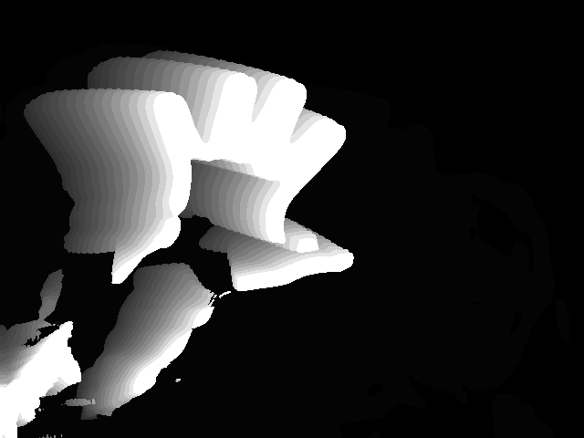

# Frame Differencing trial

Ezen egyszerű script az ún. *Frame Differencing* technika kipróbálására lett létrehozva.
* A technika egy OpenCV függvénnyel, a `cv2.absdiff` -el lett megvalósítva, amely két képet vár paraméterként, majd ezek abszolút különbségét adja vissza kimenetként.
* Az így kapott képen ezután egy `cv2.blur` fügvénnyel homályosítást végzek el, hogy a képen megfigyelhető digitális képzajt csökkentsem. Az elhomályosítás mértéke paraméterként megadható a függvénynek.
* Ezután az így kapott képen küszöbölést hajtok végre, amelyet a `cv2.threshold` metódussal valósítok meg. A metódus 4 paramétert vár: a bemeneti képet, a küszöb alsó határát, a küszöb felső határát és a küszöbölés típusát. Az eljárás két kimenettel rendelkezik, az első visszaadja a használt threshold típusát, a második pedig a kimeneti küszöbölt képet. [Thresholding dokmentáció](http://www.uni-miskolc.hu/~qgenagyd/references/OpenCVThresholding/OpenCV%20%20Image%20Thresholding.html)

```python
frameDiff = cv2.absdiff(grayFrame,oldGrayFrame)
blur = cv2.blur(frameDiff,(20,20))
ret, thresholdedFrame = cv2.threshold(blur,20,255,cv2.THRESH_BINARY)
```

