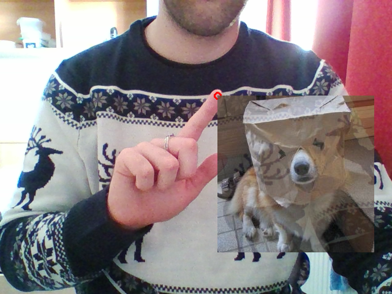
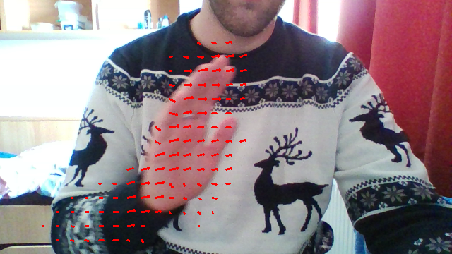
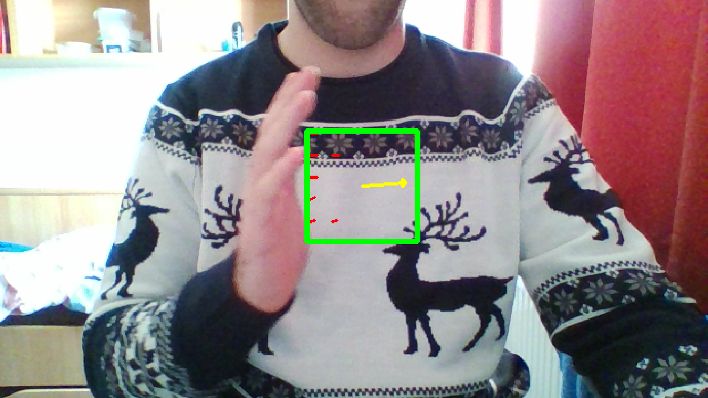

# Vector Field Trials

[Optical Flow dokumentáció](http://www.uni-miskolc.hu/~qgenagyd/references/OpenCVOpticalFlow/OpenCV%20%20Optical%20Flow.html)

## Lucas-Kanade Tracking

A **Lucas-KanadeTracking.py** script az **optcial flow** elven működő képpont követés kipróbálására lett megalkotva.
* Az optical flow megvalósítására az OpenCV két metódust is ad. Ezek közül a Bruce D. Lucas és Takeo Kanade által kidolgozott [munkáján](http://www.uni-miskolc.hu/~qgenagyd/references/lucas_kanade-1981.pdf) alapuló `cv2.calcOpticalFlowPyrLK` eljárást választottam. A másik eljárás az ún *Dense Optical Flow-t* valósítja meg. Ez nagyon számításigényesnek bizonyult még alacsony felbontás mellett is, a valós idejű futás elképzelhetetlen egy gyengébb hardver esetében. A Lucas-Kanade implementáció ezzel szemben, tapasztalatom szerint, kielégítő futási idővel kecsegtet. Az eljárásnak megadható, hogy mely képpontokra számolja ki az optical flow vektorokat. Ezen paramétert, a vizsgálandó képpontokat, egy többdimenziós numpy vektorral lehet megadni. Továbbá paraméterként vár két szürkeárnyalatos képet is és az eljárás további paramétereit, melyet *dictionary* formátumban kell átadni a metódusnak. A függvénynek három visszatérési értéke van. Az első visszadja a kiszámított új pontokat egy többdimenziós numpy vektorban. A második egy státusz változó, ami egy n elemű tömböt ad vissza, amely olyan hosszú, mint a paraméterként beadott vektor pixel koordinátapárok száma. Az elemek 0 vagy 1 értéket vehet fel. Ha az eljárás sikeres volt a vizsgált pixelnél, akkor 1 értéket kap, egyébként 0-t. A harmadik visszatérési érték pedig az error, ami szintén egy n elemű tömböt ad vissza a hiba-mérték éertékekkel. Az, hogy minek a hibáját vizsgálja paraméterezhető. A metódus paramétereiről [ebben a dokumentációban](http://www.uni-miskolc.hu/~qgenagyd/references/OpenCVObjectTracking/OpenCV%20%20Object%20Tracking.html#ga473e4b886d0bcc6b65831eb88ed93323) lehet részletes leírást találni.
* A **Lucas-KanadeTracking.py** script egy egérrel kiválasztott pontot követ a fent említett Lucas-Kanade módszert felhasználva. A program fő ciklusán belül minden egyes képkockán megkeresi a módszer segítségével, hogy a kijelölt pont hova mozdult el. A követett pontot egy piros körrel jelöli a program.
* A scriptben szerepel egy fontos függvény is, a `cv2.addWeighted` eljárás, amellyel képeket lehet egymásba "mosni". A script a *random.jpeg* képet a követett pont helyzetéhez képest helyezi rá a webkamera képére. Az eljárás dokumentációja [itt érhető el](http://www.uni-miskolc.hu/~qgenagyd/references/OpenCVImageBlending/OpenCV%20%20Operations%20on%20arrays.html#gafafb2513349db3bcff51f54ee5592a19).

## Lucas-Kanade Vector Field

A **Lucas-KanadeVectorField.py** script egy ún. *Vector Field*-et vagyis egy "*vektor mezőt*" valósít meg a korábbi scriptben használt Lucas-Kanade eljárás segítségével.
* Az ötlet lényege az, hogy a vizsgálandó pontok egy rácsban helyezkednek el. Így a képtartományt egyenletesen lefedik a pontok. A mozgás detektálása így kevesebb számítást igényel, mintha minden egyes pixel elmozdulását vizsgálnánk.
* A program minden iteráció végén visszaállítja a pontokat az eredeti helyükre, hogy a következő lépésben újra ezekkel a pontokkal vizsgálja meg a pontok eltéréseit az előző és az aktuális képkockán.
* A kapott új pontokat és a régi pontokat az OpenCV `cv2.arrowedLine` primitívkirajzoló függvényével rajzolt nyilaival ábrázolja a program.

## Vector Field Shift

A **VFShift.py** scriptben a korábban megvalósított "*vektor mező*" által kapott értékeket felhasználva módosíthatjuk egy OpenCV `cv2.rectangle` primitívvel a webkamera képére rajzolt téglalap helyzetét. A program használata közben úgy érezhetjük, mintha a virtuális element, például a kezünk segítségével, tologatnánk.
* A megvalósítás csupán annyi, hogy az új pontok meghatározása után a script az összes vizsgált ponton végigmenve megvizsgálja, hogy melyek azok a "régi" pontok, amelyek a téglalap belselyében helyezkednek el. Ezeket a pontokat és a hozzájuk tartozó új pontokból számol egy eredő vektort, majd a kapott vektor segítségével meghatározza a téglalap következő pozícióját.

