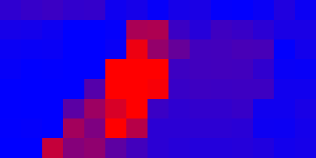

# Module Testing Trial

Az eddig kipróbált eljárások, megoldások csokorbaszedése.

## vectorFieldModule.py

A modulban található eljárások bővebb leírása és további példák [**itt**](../Lucas-Kanade) érhetők el.

A modulban található metódusok:

caclOpticalFlow(oldGrayFrame,grayFrame,oldPoints)
* A `cv2.calcOpticalFlowPyrLK`-t hívja meg a kapott paraméterekkel. Az Optical Flow további paraméterei a modulban vannak definiálva

vectorFieldGrid(gridStep, capWidth, capHeight)
* Elkészíti a pontok halmazát, amelyek segítségével a vektormezőt megvalósíthatjuk.
    
drawVectorField(canvas,oldPoints,newPoints)
* Kirajzolja a vektormezőt a `cv2.arrowedLine` primitívrajzoló segítségével.

getVectorLength(vector)
* Visszaadja a paraméterként megadott vektor hosszát.

showResults(vectorLengths,globalDirection)
* Futás közbeni grafikonok kirajzolása az OpenCV primitívkirajzoló függvényei segítségével. Bal oldalt a globális eredő vektor hosszának változása figyelhető meg az elmúlt 30 képkockára nézve. Jobb oldalt pedig a globális eredővektor iránya látható.

* A *matplotlib* segítségével igényesebb ábrák készíthetők el. De a szépség a futásidő kárára megy. A program lesz nem képes valós időben működni. Szemléltetésnek a primitívek használata is megfelelő eredményt ad.

HeatMap
* A vektormező egyes vektorainak a hossza ebben a mátrixban figyelhető meg. Minél hosszabb egy vektor, annál pirosabb színnel jelöli a program. Terveim szerint az így kapott képet vizsgálva, meghatározható, hogy mely vektorok tartoznak egybe. Ez az információ további funkciók megvalósításához szolgálhat segítségül. Ilyen funkció például az ellentétes irányú mozgások vizsgálata is.

## framediffModule.py

Ezen modulban egyetlen definíció található.

frameDifferencing(grayFrame,oldGrayFrame,canvas)
* Működése megegyezik a [**Frame Differencing trial**](../FrameDifferencing)-ban leírt eljáráséval.
